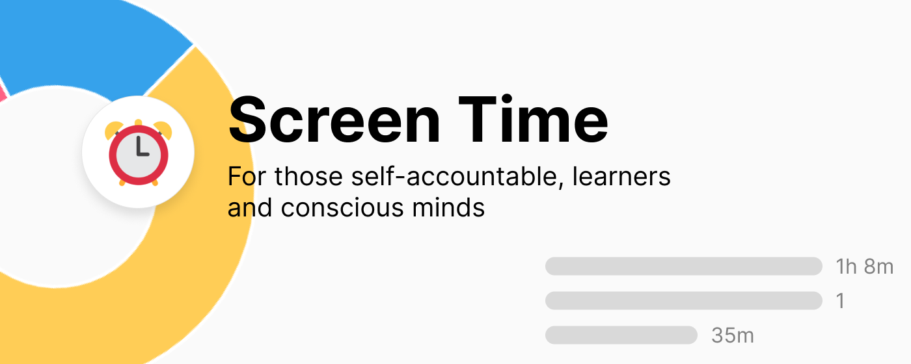
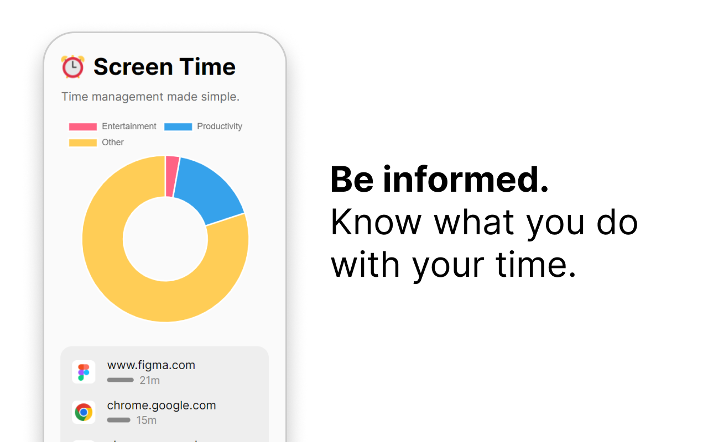
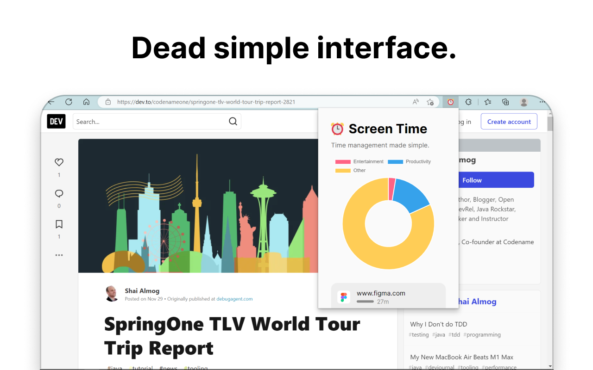

# Screen Time

Time management made simple.

Screen Time is a Chrome extension that tracks your web browser usage. If you want to use this extension for yourself, note that **website content is sent to an external API** that classifies what type of website you are visiting (entertainment, productivity, or something else). The model and API is open source and is located within the `server` folder of this repository.

## Screenshots

